# RayTracer
_Photorealistic Image Renderer – Built with Julia_

[](https://github.com/baronauta/RayTracer/releases)
[](https://github.com/baronauta/RayTracer/blob/master/LICENSE.md)
[](https://julialang.org/)
[](https://github.com/baronauta/RayTracer#requirements)
[](https://github.com/baronauta/RayTracer)
[](https://github.com/baronauta/RayTracer/actions/workflows/action.yml)

**RayTracer** is a text-based ray tracing engine built in Julia, designed to render photorealistic images from user-defined 3D scenes. It supports high-dynamic-range rendering and offers flexible output options, including tone-mapped conversions to common image formats.

### Core Features

- 🖼️ **Ray Tracing Renderer**  
  Renders photorealistic images from 3D scenes using multiple ray tracing algorithms ([Scene Rendering](#scene-rendering)). It also supports dynamic camera movements to create scene animations ([Animationn](#animation)).

- 🌈 **Tone Mapping**  
  Converts high-dynamic-range `.pfm` images into standard low-dynamic-range formats (e.g. `.png`) for display and sharing ([Tone Mapping](#tone-mapping)).

- 🔁 **Image-to-PFM Converter**  
  Transforms standard LDR images (`.png`, `.jpg`) into HDR `.pfm` format, enabling their use as textures or lighting sources in rendering ([LDR to HDR Conversion](#ldr-to-hdr-conversion)).

## Installation

### Requirements
RayTracer is a Julia-based library that runs on:

- **Julia v1.x** – [Install Julia](https://julialang.org/downloads/)
- **Supported OS**: Linux or Windows
- **ffmpeg** – [Install ffmpeg](https://ffmpeg.org/download.html) [^1]

[^1]: `ffmpeg` is required only for animation rendering and video compilation.

### Steps

1. Download the [v2.1.1 release](https://github.com/baronauta/RayTracer/releases/tag/v2.1.1) and extract the archive.

2. Open a terminal and navigate to the extracted directory.

2. Launch Julia:
    ```bash
    julia
    ```

3. Activate the project and install dependencies:
    ```julia
    using Pkg
    Pkg.activate(".")
    Pkg.instantiate()
    ```

4. *(Optional)* Run tests to verify installation:
    ```julia
    Pkg.test()
    ```


## Usage Instructions
> ℹ️ **Tip:** To see a brief overview of available options and usage info for *any* command or tool, you can use the `-h` flag with that command. For example:  ```julia RayTracer <command> -h``` or ```julia image2pfm -h```

### Scene Rendering

RayTracer uses a simple text-based format for scene description. See [guidelines.md](./guidelines.md) for the details on how to define your own scenes.

To render a scene, run the following command:
```bash
julia RayTracer <tracer> <scenefile> <witdth> <height>
```
where `<scenefile>` is the `.txt` file with the scene to render, `<tracer>` selects the rendering algorithm and and `<width>` and `<height>` specify the image resolution.

Each run produces a **high-dynamic-range (HDR)** image in the `.pfm` format storing detailed lighting and color information, and a quick low-dynamic-range LDR preview (e.g. `.png`) for viewing (basic default tone mapping is used).  
For more control over the LDR output, apply custom tone mapping — see the [Tone Mapping](#tone-mapping) section.
### Scene Structure
A typical scene description consists of two main parts:

- **Shapes**  
  The geometric objects that make up the scene $-$ spheres, planes and cubes. 
  They can be combined into complex objects using Constructive Solid Geometry ([CSG](#constructive-solid-geometry)). For more information on available shapes see [guidelines.md](./guidelines.md#-3-objects).
- **Camera**  
 Defines the viewpoint, orientation, and perspective from which the scene is rendered.

RayTracer simulates a camera by casting rays—lines representing paths of light—from the camera’s position through each pixel into the scene. These rays are tested for intersections with the shapes defined in the scene. The rendering algorithm then determines how light interacts at these intersections to compute the final pixel color.


### Available Tracers

- **`pathtracer`**  
  A physically-based renderer that simulates realistic lighting, including global illumination, soft shadows, and reflections.

- **`flattracer`**  
  A fast, non-photorealistic renderer that returns the surface color and emitted light at the ray intersection. It ignores lighting, shadows, and reflections.  
  Useful for quick previews, geometry debugging, and visualizing base materials.

- **`onofftracer`**  
  A minimal tracer that detects ray-object intersections only, without computing lighting or color.
  Returns white for hits and black for misses.  
  Useful for visibility checks and fast silhouette previews.


### Antialiasing

All tracers support *antialiasing* via the `--samples-per-pixel` option, a technique that reduces variance and visual artifacts by casting multiple rays per pixel.  
An example comparing images with and without antialiasing can be found in the [Feature Gallery](#feature-gallery) section.


### Usage

To display usage instructions and available options for a specific tracer, use the `-h` flag:
```bash
julia RayTracer <tracer> -h
```
<div id="figure-1"></div>
<table width="100%">
  <tr>
    <td align="center" width="33%">
      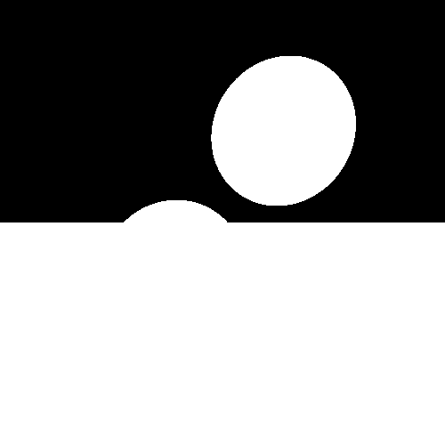<br>
      <code>onofftracer</code>
    </td>
    <td align="center" width="33%">
      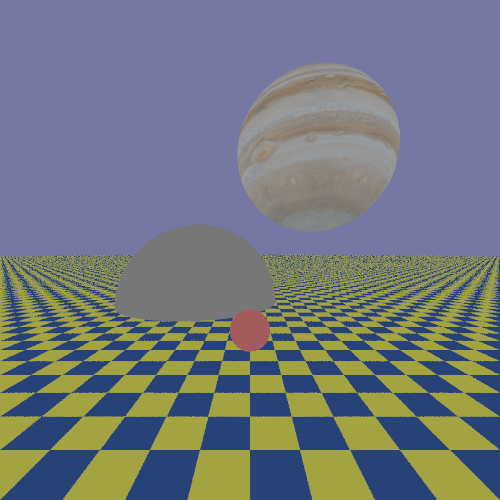<br>
      <code>flattracer</code>
    </td>
    <td align="center" width="33%">
      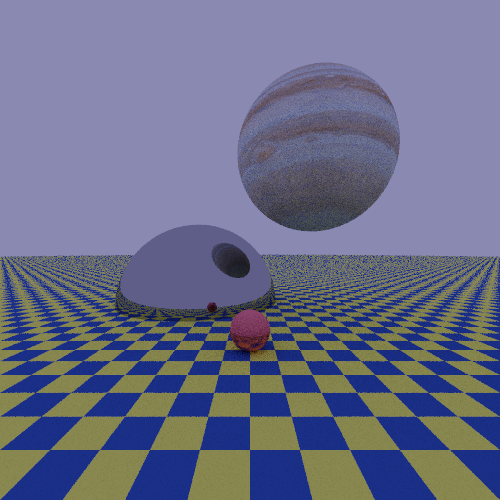<br>
      <code>pathtracer</code>
    </td>
  </tr>
</table>
<p><em><strong>Figure 1</strong></em>: The same <a href="./examples/demo.txt">scene</a> rendered using the three available tracer algorithms.
For the <code>onofftracer</code>, the large sphere simulating the sky was commented out to avoid it being treated as a hit surface. (Texture source: <a href="https://www.solarsystemscope.com/textures/">Jupiter texture © Solar System Scope</a> – <a href="https://creativecommons.org/licenses/by/4.0/">CC BY 4.0</a>).
</p>

> ⚠️ **Note:** Rendering your scene when using the `pathtracer`, may take a considerable amount of time due to the complexity of realistic light simulations.


### Try by yourself
You can reproduce these results by using the input file `examples/demo.txt` and selecting one of the available tracers:

```bash
julia RayTracer <tracer> examples/demo.txt 500 500
```

### Available Cameras
Two types of cameras are available:

- **Perspective Camera** — Simulates a realistic camera with perspective projection, where objects farther away appear smaller. 

- **Orthogonal** — Uses orthographic projection, which preserves object sizes regardless of depth. This is ideal for technical or architectural visualization where true dimensions are important.

<div id="figure-2"></div>
<table width="100%">
  <tr>
    <td align="center" width="50%">
      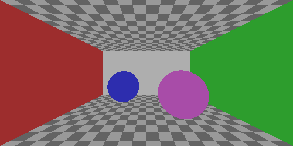<br>
      <em>Perspective camera</em>
    </td>
    <td align="center" width="50%">
      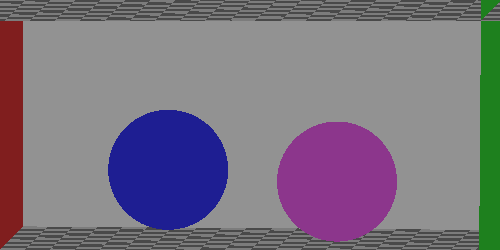<br>
      <em>Orthogonal camera</em>
    </td>
  </tr>
</table>
<p><em><strong>Figure 2</strong></em>: Perspective and orthogonal camera views. Minor adjustments to camera positions were made for aesthetic presentation.</p>


### Constructive Solid Geometry

*Constructive Solid Geometry (CSG)* is a modeling technique used to build complex shapes by combining simpler ones through boolean operations such as `union`, `fusion`, `intersection`, and `difference`. These operations define how the volumes of the input shapes interact—for example, by merging them or subtracting one from another. CSG operations can be nested to create intricate hierarchical structures. For usage details, see [guidelines.md](./guidelines.md#-4-constructive-solid-geometry-csg).


<div id="figure-3"></div>
<table width="100%">
  <tr>
    <td align="center" width="33%">
      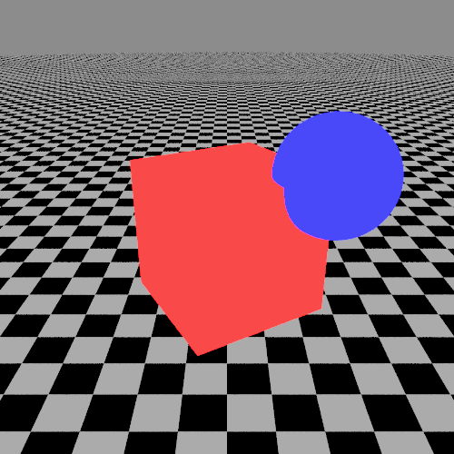<br>
      <em>Union</em>
    </td>
    <td align="center" width="33%">
      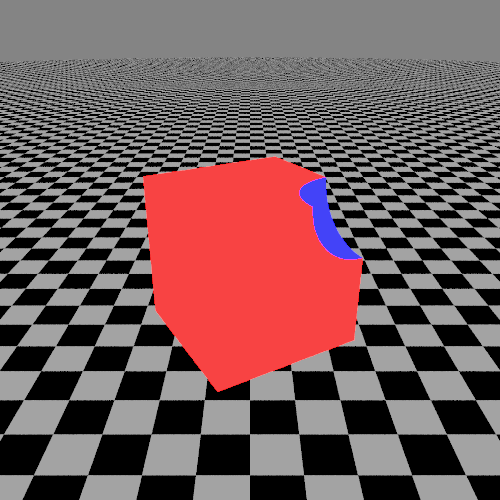<br>
      <em>Difference</em>
    </td>
    <td align="center" width="33%">
      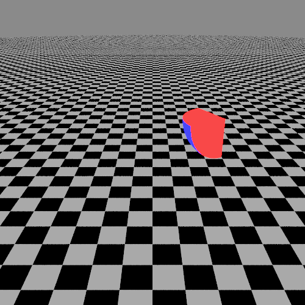<br>
      <em>Intersection</em>
    </td>
  </tr>
</table>
<p><em><strong>Figure 3</strong></em>: Examples of shapes built using Constructive Solid Geometry (CSG) with different boolean operations.</p>

---

### Tone Mapping

Once you have the `.pfm` file, you can apply **tone mapping**—the process of converting HDR images into LDR ones suitable for standard displays.  
Because tone mapping is scene-dependent, we encourage you to experiment with different parameters to achieve optimal visual results.

To perform tone mapping, run the following command
```bash
julia RayTracer tonemapping <input_file>
```
where `<input_file>` is the PFM file you want to convert.

> ℹ️ **Note**: The LDR formats supported are `.jpg`, `.png`, `.tif`.
---
### Animation

Once a scene is defined, you are not limited to rendering it from a fixed point of view. You can explore the scene dynamically by adding the following line to the scene description file:
```bash
motion(<transformation>, <num_of_frames>)
```
Then, generate the animation by running:
```bash
julia Animation <tracer> <scenefile>
```
This command applies the specified transformation over the given number of frames and renders each frame. Finally, the frames are compiled into an MP4 video.

#### Tonemapping is also available for animations

To apply it to all the .pfm images in a folder and generate a tone-mapped animation, use:
```bash
julia Animation tonemapping <frame_folder>
```

> ⚠️ **Note:** Frame creation in PFM format is always performed. However, if [_ffmpeg_](https://ffmpeg.org/download.html) is not installed, the MP4 animation will not be generated automatically. In this case, you can manually combine the PFM frames into a video using your preferred tools.

---
### LDR to HDR Conversion

RayTracer also supports converting **low-dynamic-range (LDR)** images (e.g., `.png`, `.jpg`) into **high-dynamic-range (HDR)** `.pfm` format. This feature is useful for integrating external images or textures into HDR-based rendering.
To perform the conversion, run:

```bash
julia image2pfm <input_image>
```
---
### Feature Gallery

<div align="center">
<div id="image-1"></div>
<table width="100%">
  <tr>
    <td align="center" width="100%">
      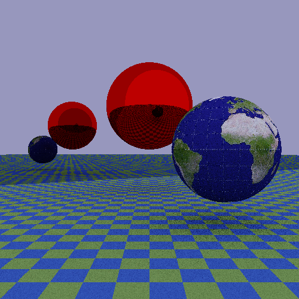
      <em style="display:block; margin-bottom: 24px;"><strong>Image 1</strong>: Two spheres with a mirror.</em>
    </td>
  </tr>
</table>
</div>


<div id="image-2"></div>
<table width="100%" style="margin-bottom: 32px;">
  <tr>
    <td align="center" width="33%">
      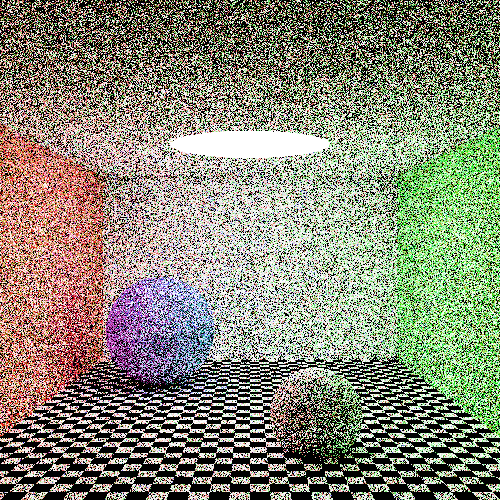
      <code style="display:block; margin-bottom: 16px;">samples-per-pixel=1</code>
    </td>
    <td align="center" width="33%">
      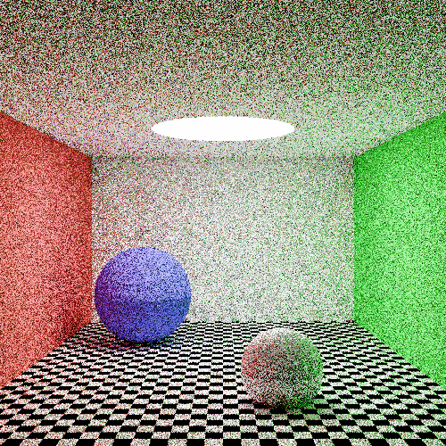
      <code style="display:block; margin-bottom: 16px;">samples-per-pixel=4</code>
    </td>
    <td align="center" width="33%">
      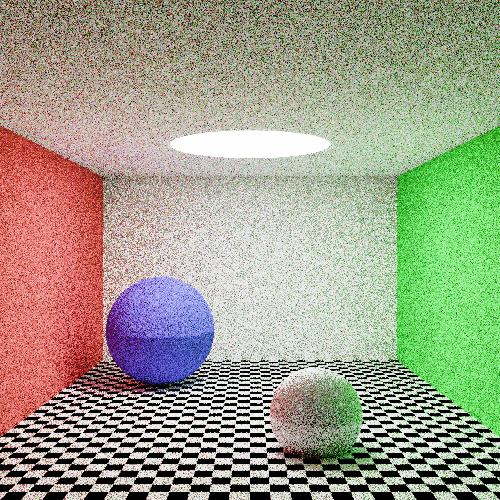
      <code style="display:block; margin-bottom: 16px;">samples-per-pixel=9</code>
    </td>
  </tr>
  <tr>
    <td colspan="3" align="center">
      <em><strong>Image 2</strong>: Effect of increasing antialiasing: higher sample counts yield smoother edges and less noise.</em>
    </td>
  </tr>
</table>


<div id="image-3"></div>
<table width="100%">
  <tr>
    <td align="center" width="100%">
      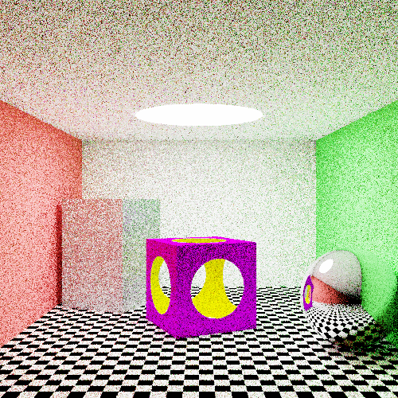
      <em style="display:block; margin-bottom: 24px;"><strong>Image 3</strong>: Example of a complex shape created with CSG 'difference' operation.</em>
    </td>
  </tr>
</table>


<div id="image-4"></div>
<table width="100%">
  <tr>
    <td align="center" width="100%">
      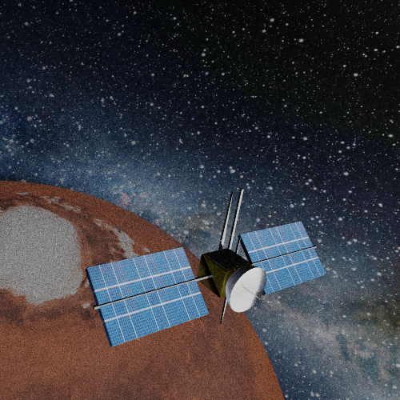
      <em style="display:block; margin-bottom: 24px;"><strong>Image 4</strong>: When Cubes Dream of Stars: The Majesty of CSG and ImagePigment (Texture source: <a href="https://www.solarsystemscope.com/textures/">Mars texture © Solar System Scope</a> – <a href="https://creativecommons.org/licenses/by/4.0/">CC BY 4.0</a>).</em>
    </td>
  </tr>
</table>

<div align="center">
<table width="100%">
  <tr>
    <td align="center" width="100%">
      
      <br>
      <em>
        <strong>Image 5</strong>: "The universe (which others call the Library)..."<br>
        — Jorge Luis Borges, The Library of Babel.<br>
        <small>
          Image texture from <a href="https://www.vecteezy.com/free-vector/academic" target="_blank" rel="noopener noreferrer">Academic Vectors by Vecteezy</a>
        </small>
      </em>
    </td>
  </tr>
</table>
</div>


## History
See the file [HISTORY.md](https://github.com/baronauta/RayTracer/blob/master/HISTORY.md).

## Contributing

Contributions are welcome!  
If you'd like to report a bug, suggest a feature, or submit code, feel free to open an issue or a pull request.  
Please include a clear and detailed description of your changes or suggestions.

➡️ Make sure to update tests as appropriate, and check for compatibility with the existing codebase.


## License
The code is released under the European Union Public Licence (EUPL), version 1.2. See the file [LICENSE.md](./LICENSE.md).

## Authors
Developed by [baronauta](https://github.com/baronauta) and [Stefano-Bozzi](https://github.com/Stefano-Bozzi).
