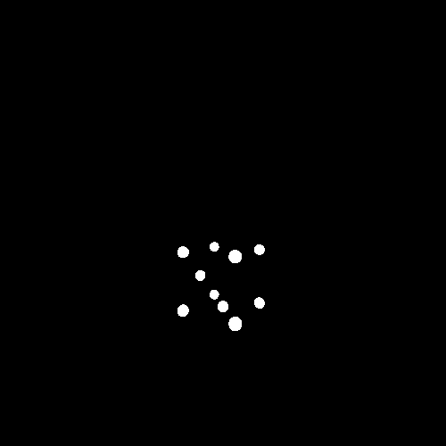
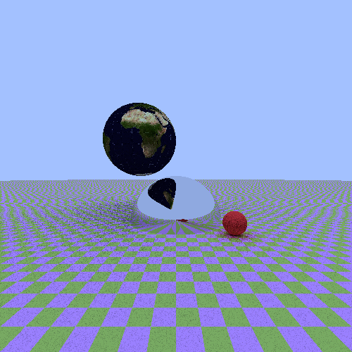

# RayTracer
_Photorealistic Image Renderer – Built with Julia_

[](https://github.com/baronauta/RayTracer/releases)
[](https://github.com/baronauta/RayTracer/blob/master/LICENSE.md)
[](https://julialang.org/)
[](https://github.com/baronauta/RayTracer#requirements)
[](https://github.com/baronauta/RayTracer)
[](https://github.com/baronauta/RayTracer/actions/workflows/action.yml)

**RayTracer** is a text-based ray tracing engine built in Julia, designed to render photorealistic images from user-defined 3D scenes. It supports high-dynamic-range rendering and offers flexible output options, including tone-mapped conversions to common image formats.


## Installation

### Requirements
RayTracer is a Julia-based library that runs on:

- **Julia v1.x** – [Install Julia](https://julialang.org/downloads/)
- **Supported OS**: Linux or Windows

### Steps

1. Launch Julia:
    ```bash
    julia
    ```

2. Add RayTracer from GitHub:
    ```julia
    using Pkg
    Pkg.add(url="https://github.com/baronauta/RayTracer/releases/tag/v1.0.0")
    ```

3. *(Optional)* Run tests to verify installation:
    ```julia
    Pkg.test()
    ```


## Usage Instructions

RayTracer uses a simple text-based format for scene description. See [guidelines.md](https://github.com/baronauta/RayTracer/blob/master/guidelines.md) for the details on how to define your own scenes.

To render a scene, run the following command:
```bash
julia RayTracer <tracer> <witdth> <height>
```
where `<tracer>` selects the rendering algorithm and and `<width>` and `<height>` specify the image resolution.

### Scene Structure
A typical scene description consists of two main parts:

- **Shapes**  
  The geometric objects that make up the scene — such as spheres or planes. 
- **Camera**  
 Defines the viewpoint, orientation, and perspective from which the scene is rendered.

RayTracer simulates a camera by casting rays—lines representing paths of light—from the camera’s position through each pixel into the scene. These rays are tested for intersections with the shapes defined in the scene. The rendering algorithm then determines how light interacts at these intersections to compute the final pixel color.


### Available Tracers

- **`pathtracer`**  
  A physically-based renderer that simulates realistic lighting, including global illumination, soft shadows, and reflections.

- **`flattracer`**  
  A fast, non-photorealistic renderer that returns the surface color and emitted light at the ray intersection. It ignores lighting, shadows, and reflections.  
  Useful for quick previews, geometry debugging, and visualizing base materials.

- **`onofftracer`**  
  A minimal tracer that detects ray-object intersections only, without computing lighting or color.
  Returns white for hits and black for misses.  
  Useful for visibility checks and fast silhouette previews.


To display usage instructions and available options for a specific tracer, use the `-h` flag:
```bash
julia RayTracer <tracer> -h
```

**Note** — Rendering your scene, particularly when using the `pathtracer`, may take a considerable amount of time due to the complexity of realistic light simulations.

### Tone mapping
Each run of RayTracer produces a **high-dynamic-range (HDR)** image in the `.pfm` format, which stores detailed lighting and color information from the rendered scene.

Along with the HDR output, a quick preview image in a standard low-dynamic-range (LDR) format (e.g. `.png`) is also generated for easy viewing.

Once you have the `.pfm` file, you can apply **tone mapping**—the process of converting HDR images into LDR ones suitable for standard displays.  
Because tone mapping is scene-dependent, we encourage you to experiment with different parameters to achieve optimal visual results.

To perform tone mapping, run the following command
```bash
julia RayTracer tonemapping <input_file>
```
where `<input_file>` is the PFM file you want to convert.

### LDR to HDR Conversion

RayTracer also supports converting **low-dynamic-range (LDR)** images (e.g., `.png`, `.jpg`) into **high-dynamic-range (HDR)** `.pfm` format. This feature is useful for:

- Integrating external images or textures into HDR-based rendering.
- Testing reverse tone mapping pipelines.
- Preparing LDR inputs for HDR-aware workflows.

To perform the conversion, run:

```bash
julia RayTracer image2pfm <input_image>
```

### Feature Gallery
<table width="100%">
  <tr>
    <td align="center" width="33%">
      <br>
      <em><strong>onoff_tracer</strong>, 20° angle</em>
    </td>
    <td align="center" width="33%">
      <br>
      <em><strong>flat_tracer</strong>, 360° animation</em>
    </td>
    <td align="center" width="33%">
      <br>
      <em><strong>path_tracer</strong>, static image</em>
    </td>
  </tr>
</table>


## History
See the file [HISTORY.md](https://github.com/baronauta/RayTracer/blob/master/HISTORY.md).

## License
The code is released under the European Union Public Licence (EUPL), version 1.2. See the file [LICENSE.md](./LICENSE.md).

## Authors
Developed by [baronauta](https://github.com/baronauta) and [Stefano-Bozzi](https://github.com/Stefano-Bozzi).
